# Liberty Config Language Server

> Note: Starting with the [Liberty LemMinX Language Server 1.0-M1 early release](https://github.com/OpenLiberty/liberty-language-server/releases/tag/lemminx-liberty-1.0-M1) and [Liberty Config Language Server 1.0-M1 early release](https://github.com/OpenLiberty/liberty-language-server/releases/tag/liberty-langserver-1.0-M1), Java 17 is required.

The Liberty Config Language Server provides language server features for Liberty server configuration files through any of the supported client IDEs. It adheres to the [language server protocol](https://github.com/Microsoft/language-server-protocol).

## Client IDEs

The Liberty Config Language Server is included in the following client IDEs.

* [Liberty Tools for Visual Studio Code](https://github.com/OpenLiberty/liberty-tools-vscode)
* [Liberty Tools for Eclipse IDE](https://github.com/OpenLiberty/liberty-tools-eclipse)
* [Liberty Tools for IntelliJ IDEA](https://github.com/OpenLiberty/liberty-tools-intellij)

## Supported files

Liberty Config Language Server features are available for the following configuration files.

- Any XML file that contains a `server` root element.
- A `server.env` file located in a directory specified by the `configDirectory` configuration in the Liberty Maven or Gradle plugin, or in the default `src/main/liberty/config` directory.
- Any file with the extension `.env` that is specified by the `serverEnvFile` configuration in the Liberty Maven or Gradle plugin.
- A `bootstrap.properties` file located in a directory specified by the `configDirectory` configuration in the Liberty Maven or Gradle plugin, or in the default `src/main/liberty/config` directory.
- Any file with the extension `.properties` that is specified by the `bootstrapPropertiesFile` configuration in the Liberty Maven or Gradle plugin.

## Features

The following language server features are available through any of the supported client IDEs.

### Completion for Liberty server configuration files

Start typing a Liberty property, variable, or XML configuration to view a list of possible options.

* Completion for Liberty properties and values 

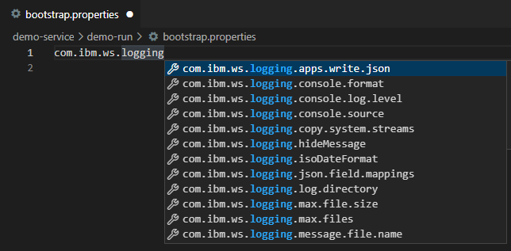 
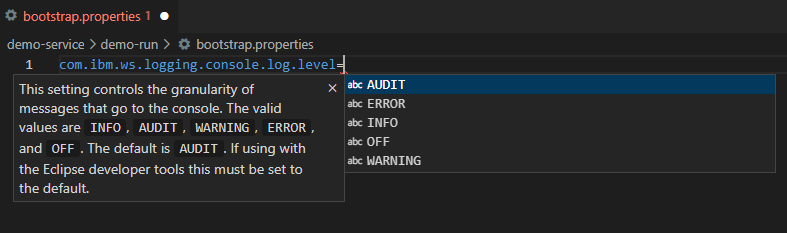
* Completion for Liberty variables and values 

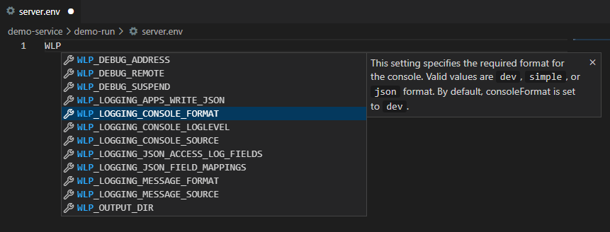
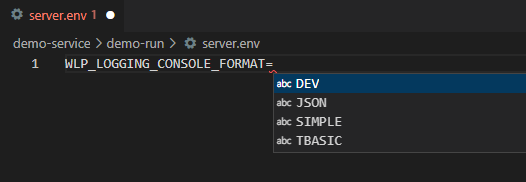
* Completion for Liberty XML configs

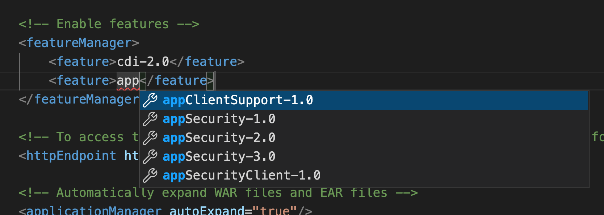

### Hover on Liberty server configuration files

Hover your cursor over Liberty properties, variables, or XML configuration to view a description.

* Hover for Liberty properties and variables

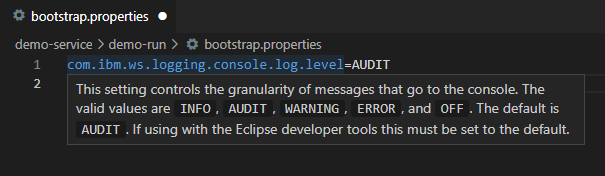
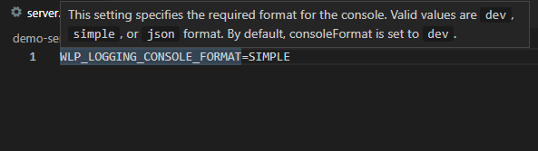

* Hover for Liberty XML configs

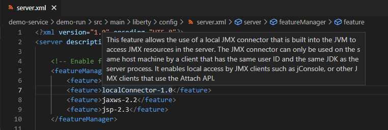

### Diagnostics and quick fixes on Liberty server configuration files

Diagnostics highlight potential problems in your configuration, such as invalid values. Quick fixes provide potential solutions to those problems.

* Diagnostics and quick fixes for Liberty properties and variables

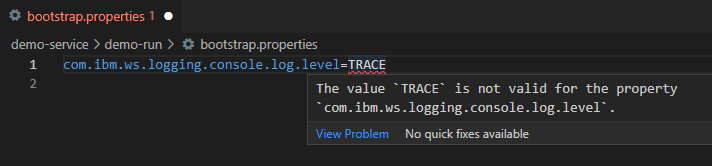

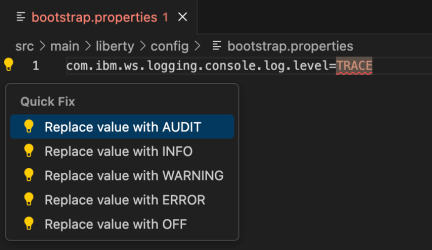

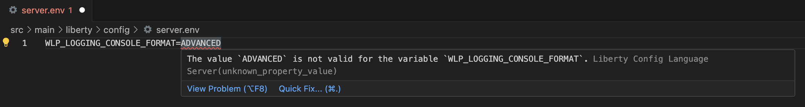

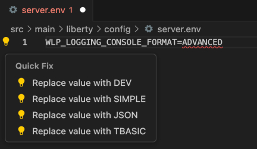

* Diagnostics and quick fixes for Liberty XML configs

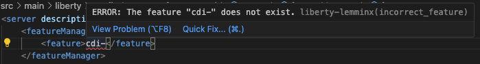

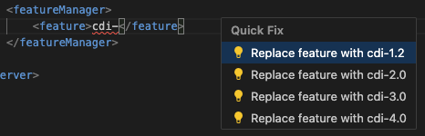

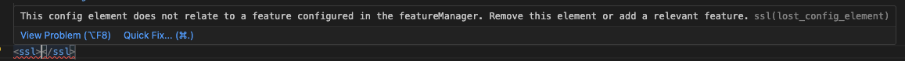

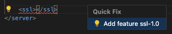

## Minimum version recommendations for the Liberty Maven and Gradle plug-ins

A minimum version of the Liberty Maven Plug-in 3.7.1 or Liberty Gradle Plug-in 3.5.1 is recommended. 

If you are using dev mode for containers, a minimum version of the Liberty Maven Plug-in 3.7 or Liberty Gradle Plug-in 3.5 is recommended. If an earlier version is used, the Liberty Config Language Server cannot generate a schema file for use with `server.xml` editing. In this case, a default schema that is based on Liberty 25.0.0.6 is used instead.

### Schema and Feature Validation
If the [Liberty Maven Plug-in](https://github.com/OpenLiberty/ci.maven) or [Liberty Gradle Plug-in](https://github.com/OpenLiberty/ci.gradle) is configured with the Liberty project, the Liberty Config Language Server automatically generates a schema file based on the Liberty runtime and version. This schema file provides relevant information about the supported `server.xml` elements and Liberty features. If an earlier version of either plug-in is used, the schema file is not regenerated when additional features are installed. This limitation might result in a lack of hover, completion, or diagnostic support for elements related to those newly installed features.

Liberty Tools prioritizes accurate and up-to-date schema and feature validation. While it includes periodically updated cached data, the most reliable validation occurs when you **build your project**. Building your project allows Liberty Tools to generate schema and feature information directly from the Open Liberty runtime specified in your project's configuration. This ensures that validation is based on the exact version of Open Liberty you are using, preventing issues caused by potentially outdated cached data.

**How to build your Open Liberty project:**

* **With Maven:** Navigate to your project's root directory in your terminal and run:
    ```bash
    mvn clean liberty:run
    ```
  For fast, iterative development with automatic hot deployment and on-demand testing, use dev mode:
    ```bash
    mvn liberty:dev
    ```
  Refer [Goals](https://github.com/OpenLiberty/ci.maven?tab=readme-ov-file#goals) for more details
* **With Gradle:** Navigate to your project's root directory in your terminal and run:
    ```bash
    ./gradlew libertyRun
    ```
  For fast, iterative development with automatic hot deployment and on-demand testing, use dev mode:
    ```bash
    ./gradlew libertyDev
    ```
  Refer [Tasks](https://github.com/OpenLiberty/ci.gradle?tab=readme-ov-file#tasks) for more details

For the most accurate validation, always ensure your project has been successfully built.
## Contributing
See the [DEVELOPING](./DEVELOPING.md) and [CONTRIBUTING](./CONTRIBUTING.md) documents for more details.
## License
Eclipse Public License - v 2.0 See [LICENSE](./LICENSE) file.
