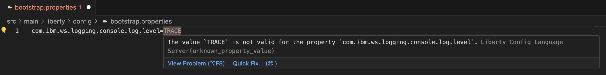

# Liberty Config Language Server

liberty-language-server adheres to the [language server protocol](https://github.com/Microsoft/language-server-protocol)
and is available for use with the following clients.

# Client IDEs
* [VS Code](https://github.com/OpenLiberty/liberty-tools-vscode/tree/liberty-ls-prototype)
* [Eclipse](https://github.com/OpenLiberty/liberty-tools-eclipse)
* [Intellij](https://github.com/OpenLiberty/liberty-tools-intellij)

## Features

### Hover on `server.xml` files and  Liberty properties and variables
* Hover for Liberty properties 
* Hover for Liberty variables 

### Completion for Liberty properties and variables
* Completion for Liberty properties 
* Completion for Liberty property values 
* Completion for Liberty variables 
* Completion for Liberty variable values 

### Diagnostics on Liberty properties and variables
* Diagnostics on Liberty properties 
* Diagnostics on Liberty variables 