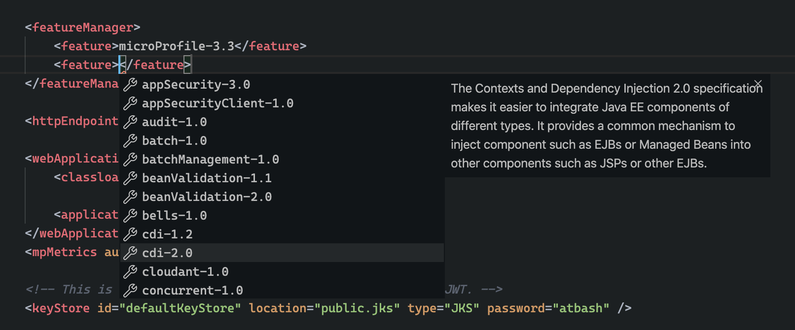

# lemminx-liberty

Extension to the [Eclipse LemMinX](https://github.com/eclipse/lemminx) XML language server providing language features for the Open Liberty server.xml file.

## Features

- Schema element completion, hover and validation using the [server.xsd](https://github.com/OpenLiberty/liberty-language-server/blob/master/lemminx-liberty/src/main/resources/schema/xsd/liberty/server.xsd) file

- Completion, hover and validation support for liberty features

- Document Links for `<include>` elements

